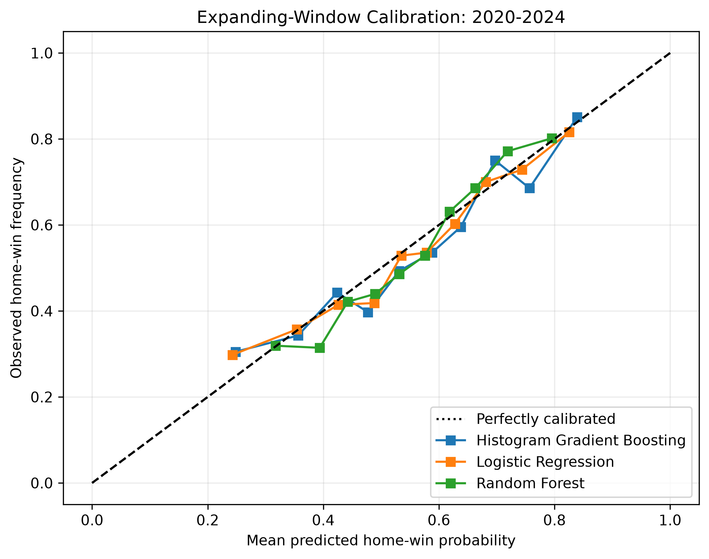
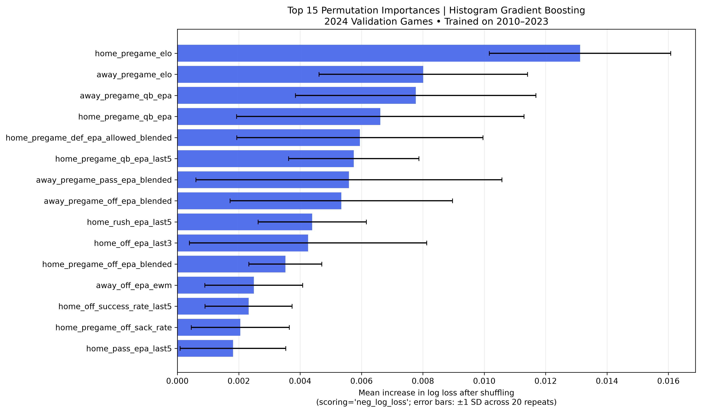
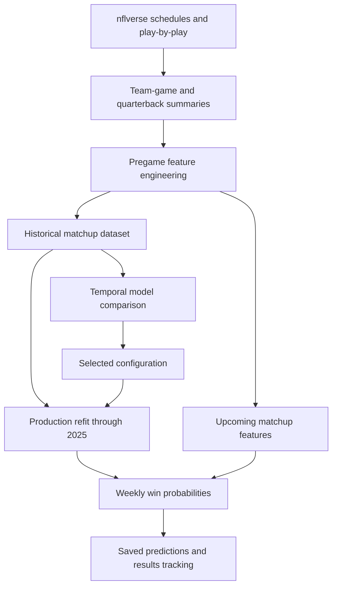

# NFL Win Probability Model

**Pregame win probabilities built from football performance, quarterback history, and team strength.**


A Python machine-learning project that predicts NFL game winners and home-team win probabilities using historical schedule and play-by-play data. The project covers data preparation, feature engineering, chronological model evaluation, and a reusable weekly prediction workflow for the 2026 season.

| Historical test accuracy | Model inputs | Temporal validation | Selected model |
|:---:|:---:|:---:|:---:|
| **65.85%** | **73** | **2020–2024** | **Histogram Gradient Boosting** |

The accuracy above is from 284 non-tied games in the 2025 historical test season, including regular-season and postseason games. It is not a live 2026 performance result.

[Results](#results) · [Methodology](#methodology) · [Features](#feature-engineering) · [Getting started](#getting-started) · [Weekly predictions](#weekly-predictions) · [Limitations](#limitations)

## Project overview

NFL outcomes depend on interacting factors: team efficiency, quarterback performance, recent form, opponent quality, and scheduling context. This project turns those signals into a consistent pregame feature set and compares models on their ability to predict both winners and probabilities.

The main technical work includes:

- Converting play-by-play records into offensive and defensive team-game statistics.
- Constructing historical features that exclude the game being predicted.
- Combining previous-season priors with current-season performance to support season-opening predictions.
- Comparing linear and tree-based models across expanding chronological validation folds.
- Separating the model used for historical evaluation from the model retrained for weekly production predictions.

## Results

### Final model: 2025 historical evaluation

The selected model was fitted on **2010–2024** and evaluated on **2025**.

| Metric | Result | Interpretation |
|---|---:|---|
| Winner accuracy | **65.85%** | Share of correctly predicted winners |
| Log loss | **0.6413** | Probability error; lower is better |
| Brier score | **0.2244** | Mean squared probability error; lower is better |
| ROC-AUC | **0.6865** | Ranking discrimination; higher is better |
| Evaluation games | **284** | Non-tied regular-season and postseason games |

Winner predictions use a 0.5 home-win probability threshold. The model produces two complementary probabilities and does not estimate a separate tie probability.

**Evaluation context:** Earlier notebooks also examined 2025 benchmark results. Although the final hyperparameter search excludes 2025, this season was not an entirely untouched test set throughout project development. These results should be interpreted alongside future predictions recorded before kickoff.

### Model comparison

The following results are **mean temporal-validation metrics for 2020–2024**, with each validation season weighted equally. They are separate from the final 2025 results above.

| Tuned model | Accuracy ↑ | Log loss ↓ | Brier score ↓ |
|---|---:|---:|---:|
| Logistic Regression | 63.91% | 0.6376 | 0.2233 |
| Random Forest | 63.89% | **0.6326** | **0.2213** |
| Histogram Gradient Boosting | **64.42%** | 0.6338 | 0.2219 |

**Why gradient boosting?** It achieved the highest mean winner-prediction accuracy and led on accuracy in three of five validation seasons. Random Forest produced better mean log loss and Brier score. The final choice prioritizes a small accuracy advantage; it does not establish gradient boosting as superior on every metric or demonstrate that the difference is statistically significant.

<details>
<summary><strong>Selected hyperparameters</strong></summary>

| Parameter | Value |
|---|---:|
| `learning_rate` | `0.03` |
| `max_iter` | `300` |
| `max_leaf_nodes` | `7` |
| `min_samples_leaf` | `20` |
| `l2_regularization` | `0.0` |
| `early_stopping` | `False` |
| `random_state` | `42` |

</details>

### Calibration and model interpretation

Calibration curves compare predicted home-win probabilities with observed home-win frequencies. The project evaluates calibration visually; no separate calibration transformation is fitted.




The calibration curves compare predicted home-win probabilities with observed home-win frequencies across 2020–2024 temporal out-of-fold development predictions. Each validation season is predicted using a model trained only on earlier seasons. Predictions are grouped into 10 approximately equal-sized bins.

All three models broadly follow the ideal-calibration diagonal, although individual bins show deviations. For example, histogram gradient boosting overestimates the observed home-win frequency in a bin near 75% predicted probability. The curves suggest generally reasonable agreement across the displayed range, rather than perfect calibration.

These seasons were also used for hyperparameter tuning, so this figure describes development performance, not the final model’s 2025 test performance. No separate probability-calibration transformation was fitted.

Permutation importance for the selected configuration, trained through 2023 and evaluated on 2024, identifies home and away Elo, quarterback EPA, and several efficiency features among the leading inputs. Importance measures model reliance on this evaluation set, not causal effects; correlated features can share predictive information.



Permutation importance was measured on 2024 validation games using the selected histogram gradient-boosting configuration trained on 2010–2023. Each feature was shuffled 20 times, and importance measures the average increase in log loss relative to the unshuffled predictions. Error bars show one standard deviation across shuffles, not confidence intervals.

Home-team Elo had the largest mean importance, followed by away-team Elo and away-quarterback historical EPA. Quarterback efficiency and several offensive and defensive efficiency measures also ranked among the leading inputs.

These results describe the model's reliance on individual features for this evaluation season, not causal effects. Correlated features can provide overlapping information, so a small individual importance does not necessarily mean a feature group is uninformative.


## Methodology

### Data and prediction target

Schedule and play-by-play data are loaded through `nflreadpy` from the nflverse ecosystem. Historical data begins in **2009** to provide prior information for the first modeling season, **2010**. The research dataset extends through **2025**.

Each modeling row represents one game, with separate home-team and away-team inputs. The target, `home_win`, is 1 for a home win and 0 for an away win. Ties are excluded from classifier training and evaluation, while tied games can still contribute to historical team statistics and Elo updates.

### Data Sources

NFL schedule and play-by-play data are provided by the
[nflverse](https://nflverse.nflverse.com/) ecosystem and accessed
through the [nflreadpy](https://nflreadpy.nflverse.com/) Python package.

The project transforms these source records into team-game statistics,
historical quarterback metrics, and pregame matchup features. Feature
engineering, model evaluation, and the weekly prediction workflow are
implemented in this repository.

The project's MIT license applies to its original code. Third-party
data remains subject to its applicable source terms.

### Chronological validation

| Stage | Training seasons | Evaluation seasons | Purpose |
|---|---|---|---|
| Initial comparison | 2010–2023 | 2024 | Compare initial model configurations |
| Temporal tuning | 2010 through the preceding season | Each season from 2020–2024 | Assess configurations across five folds |
| Final historical evaluation | 2010–2024 | 2025 | Evaluate the selected configuration |
| Production refit | 2010–2025 | Upcoming 2026 games | Generate weekly predictions |

Chronological splits reflect the intended use: learning from past seasons to predict later games. Within an evaluation season, earlier completed games can update pregame features while model parameters remain fixed.

Hyperparameters are ranked within each model family by mean log loss, followed by mean Brier score. The final comparison across families considers the accuracy tradeoff described above. Out-of-fold development results use the same seasons as tuning, so they are not an independent estimate of the complete selection process.

### Preventing current-game information from entering features

- **Shifted histories:** Rolling and expanding statistics use earlier games, excluding the current game's performance.
- **Previous-season priors:** Season-level prior information is attached to the following season.
- **Pregame Elo:** Ratings are recorded before the current outcome updates them.
- **Training-only preprocessing:** Imputation and scaling, when required, are fitted on the training partition.
- **Predictor selection:** Final scores, target labels, betting lines, and market odds are excluded.

For example, a team's Week 8 efficiency features can use Weeks 1–7, but not Week 8 performance or later results.

Historical quarterback assignments use the schedule's recorded starter. A live prediction must instead identify the expected starter before kickoff. This distinction is an important limitation of retrospective evaluation.

## Feature engineering

The final model uses **36 features per team**, producing **72 team-specific inputs**, plus **neutral-site status** for **73 total inputs**.

| Feature group | Examples and purpose | Per team |
|---|---|---:|
| Blended efficiency | Offensive/defensive EPA and success rates, passing/rushing EPA | 6 |
| Three-game form | Short-window efficiency averages | 6 |
| Five-game form | Medium-window efficiency averages | 6 |
| Exponential weighting | Recent efficiency with greater weight on newer games | 6 |
| Team and opponent strength | Pregame Elo and strength of schedule | 2 |
| Scheduling and history | Rest days, short rest, previous games played | 3 |
| Ball security and pressure | Turnovers, takeaways, offensive/defensive sack rates | 4 |
| Quarterback history | Historical EPA, five-appearance EPA, historical success rate | 3 |
| **Total per team** | | **36** |

For six efficiency measures, the previous-season prior blends 70% team performance with 30% league performance. The prior receives the weight of four games when combined with current-season averages. Recent-form features can remain missing early in the season; the selected histogram gradient-boosting model handles missing values directly.

**What the expanded dataset changed:** V2 adds season-opening coverage and richer football information. On shared 2024 games, V1 logistic regression still slightly outperformed V2 on accuracy and log loss. Additional features did not automatically improve the linear benchmark, motivating comparison with nonlinear models.

## Pipeline



The historical evaluation artifact and production artifact have different training cutoffs:

| Artifact | Training period | Purpose |
|---|---|---|
| `final_nfl_win_probability_model.joblib` | 2010–2024 | Support the reported 2025 evaluation |
| `production_model.joblib` | 2010–2025 | Predict subsequent games with the selected configuration |

## Repository guide


| Path | Responsibility |
|---|---|
| `notebooks/01_data_exploration.ipynb` | Inspect source data and identify relevant fields |
| `notebooks/02_feature_engineering.ipynb` | Build the V1 pregame dataset |
| `notebooks/03_baseline_model.ipynb` | Evaluate baseline models and feature representations |
| `notebooks/04_advanced_features.ipynb` | Build V2 features and a logistic regression benchmark |
| `notebooks/05_model_comparison.ipynb` | Tune, compare, interpret, and save the selected model |
| `src/config.py` | Shared configuration and feature definitions |
| `src/load_data.py` | Retrieve source data |
| `src/build_features.py` | Construct pregame model inputs |
| `src/train_production.py` | Refit and save the production model |
| `src/predict_week.py` | Generate weekly probabilities and picks |
| `src/score_predictions.py` | Evaluate saved predictions after games finish |
| `data/processed/` | Historical modeling datasets |
| `models/` | Serialized model artifacts and metadata |
| `outputs/predictions/` | Saved weekly prediction files |
| `outputs/results/` | Completed weekly results files |
| `requirements.txt` | Project dependencies |

## Getting started

### 1. Install the environment

Requirements: Python 3.13.14 (tested on Windows), Git, and internet access for source-data downloads.

```bash
git clone https://github.com/swcrockett/nfl-win-probability-model.git
cd nfl-win-probability-model
python -m venv .venv
```

Activate the environment using the command for your system:

```powershell
# Windows PowerShell
.venv\Scripts\Activate.ps1
```

```bash
# macOS / Linux
source .venv/bin/activate
```

```bash
python -m pip install -r requirements.txt
```

### 2. Prepare the historical artifacts

The production training step expects these research outputs:

- `data/processed/model_dataset_v2.csv` — exported by Notebook 4.
- `models/final_nfl_win_probability_model.joblib` — exported by Notebook 5.

If they are not distributed with the repository, run the notebooks in numbered order, restarting and running each from top to bottom. Use the notebook working directories expected by their relative paths.

### Data, model artifacts, and reproducibility

The notebooks load historical NFL schedule and play-by-play data through `nflreadpy`. Generated datasets and model artifacts have the following roles:

| Artifact                                        | Included in repository? | How to regenerate                                                                               |
| ----------------------------------------------- | ----------------------- | ----------------------------------------------------------------------------------------------- |
| `data/processed/model_dataset_v1.csv`           |    Yes          | Run Notebook 2                                                                                  |
| `data/processed/model_dataset_v2.csv`           |    Yes          | Run Notebook 4                                                                                  |
| `models/logistic_regression_v1.joblib`          |    Yes          | Run Notebook 3                                                                                  |
| `models/logistic_regression_v2.joblib`          |    Yes          | Run Notebook 4                                                                                  |
| `models/final_nfl_win_probability_model.joblib` |    Yes          | Run Notebook 5                                                                                  |
| `models/production_model.joblib`                |    Yes          | Run `python -m src.train_production` after generating the V2 dataset and final evaluation model |

**Execution order and working directories.** To reproduce the full analysis, run Notebooks 1–5 in numbered order, executing each from top to bottom with its working directory set to `notebooks/`. Run production commands from the repository root. If the V2 dataset and final evaluation model are already available, the production refit can use those artifacts without rerunning the research notebooks.

**Downloads and runtime.** Internet access is required to retrieve source data. The initial historical play-by-play download and feature-engineering steps can be substantial, while Notebook 5 repeatedly fits models during temporal hyperparameter tuning. Runtime and memory requirements depend on hardware, connection speed, and available cached data. Download size, peak memory use, and end-to-end runtime have not yet been benchmarked.

**Reproducing saved results.** Use the project dependencies listed in `requirements.txt` and compatible package versions when loading serialized models. Upstream data corrections and differences in software environments may cause regenerated datasets or metrics to differ from the saved notebook outputs.


### 3. Check feature consistency and train

Run production commands from the repository root.

```bash
# Compare script-generated historical features with the Notebook 4 export
python -m src.predict_week --season 2025 --week 10 --dry-run

# Refit the selected configuration on 2010–2025
python -m src.train_production
```

The historical feature comparison checks agreement with the notebook's calculations. It does not establish that historical starter assignments were known before kickoff. Source-data revisions may also change regenerated values.

### 4. Generate weekly predictions

```bash
# Example: run before the first kickoff of the target week
python -m src.predict_week --season 2026 --week 4
```

The documented pipeline writes the week's predictions to `outputs/predictions/2026_week_04.csv`. Check expected quarterback assignments before using the predictions, particularly after injuries or starter changes.

<details>
<summary><strong>Quarterback overrides</strong></summary>

Supply quarterback overrides as `--qb-override TEAM=QB_ID`, replacing the placeholders with a team abbreviation and an actual nflverse/GSIS player ID. Repeat the flag for multiple teams.

```bash
python -m src.predict_week --season 2026 --week 4 --qb-override TEAM=QB_ID
```

</details>

### 5. Score completed predictions

After the week's games finish, run the scoring script from the repository root:

```bash
python -m src.score_predictions --season 2026 --week 1
```

Replace the season and week with the values corresponding to your saved predictions. By default, this example reads:

```text
outputs/predictions/2026_week_01.csv
```

The script joins saved predictions to schedule scores using `game_id`, calculates outcomes, and updates two season-level files:

| Output                                        | Contents                                                                                    |
| --------------------------------------------- | ------------------------------------------------------------------------------------------- |
| `outputs/results/2026_scored_predictions.csv` | Game-level predictions, scores, actual winners, and prediction correctness                  |
| `outputs/results/2026_results.csv`            | Weekly and overall game counts, correct picks, accuracy, log loss, Brier score, and ROC-AUC |

The original prediction CSV remains unchanged. Rerunning scoring updates matching game records without adding duplicate entries.

**Unfinished games:** By default, scoring stops if any predicted game is missing either score. To score only games with both scores available, use:

```bash
python -m src.score_predictions --season 2026 --week 1 --allow-partial
```

Partial results cover only the available completed, non-tied games. Run the normal command again after the remaining games finish to update the results.

**Tied games:** Ties are excluded from scored results and performance metrics, with a warning, because the model uses a binary home-win/away-win target. Their original predictions remain in the input CSV.

**ROC-AUC:** This metric is left blank when the scored group does not contain both home wins and away wins.

To read a prediction file from a different location, supply its path explicitly:

```bash
python -m src.score_predictions --season 2026 --week 1 --prediction-file outputs/predictions/2026_week_01.csv
```

For live performance tracking, score the original predictions saved before kickoff rather than generating replacement predictions after outcomes are known.


## Weekly predictions

Live results belong in a separate record from historical evaluations. Preserve predictions before kickoff and attach outcomes after games finish.

### Example predictions — 2026 Week 1

The table below shows five predictions from the saved weekly output.

[View the full Week 1 prediction CSV](outputs/predictions/2026_week_01.csv)


| Away team | Home team | Away win probability | Home win probability | Predicted winner |
|---|---|---:|---:|---|
| NE | SEA | 36.6% | 63.4% | SEA |
| SF | LA | 39.7% | 60.3% | LA |
| ARI | LAC | 30.5% | 69.5% | LAC |
| ATL | PIT | 39.5% | 60.5% | PIT |
| BAL | IND | 65.5% | 34.5% | BAL |

<details>
<summary><strong>Live season performance</strong></summary>

**Historical reference:** 65.85% accuracy on the 2025 test season.

**Live 2026 performance:**
The results below cover saved predictions generated before each game's kickoff. Metrics are calculated across all scored, completed, non-tied games using the original predicted probabilities. Games without available final scores and tied games are excluded.

Accuracy measures correct winner selections; log loss and Brier score measure probability quality, with lower values indicating better performance. These results are updated as additional games are scored.

[View weekly and season-level results](outputs/results/2026_results.csv)


| Season | Scored games | Accuracy | Log loss | Brier score | Updated |
|---|---:|---:|---:|---:|---|
| 2026 | 48 | 58.33% | 0.6707 | 0.2394 | Week 3 |

</details>

## Limitations

- **Prior test-season inspection:** Earlier benchmark results informed project understanding before the final 2025 evaluation; a prospective season provides stronger independent evidence.
- **Starter information:** Retrospective schedule data identifies actual starters. Upcoming games require reliable pregame assignments, with manual overrides when necessary.
- **Incomplete player and context coverage:** Injuries beyond starter handling, detailed roster changes, weather, and coaching changes are not explicitly modeled by the selected inputs.
- **Season-to-season variability:** NFL sample sizes are modest, and performance varies by season. One year's accuracy is not a guarantee for the next.
- **Probability calibration:** Calibration is inspected, but probabilities have not been separately recalibrated or shown to be reliable across every probability range.
- **Binary outcomes:** Ties are excluded from classifier labels and have no separate predicted probability.
- **Retrospective data revisions:** Rebuilding features from updated source data may not reproduce the exact information available on an earlier prediction date.

## Future work

- [ ] Track a full season of predictions recorded before kickoff.
- [ ] Improve expected-starter detection and injury information.
- [ ] Make predictions against Vegas betting lines.
- [ ] Explore opponent-adjusted efficiency and weather features.
- [ ] Build an interactive dashboard for weekly matchups and historical results.

These are planned extensions rather than capabilities of the current model.

## License

This project's original code is licensed under the [MIT License](LICENSE).
